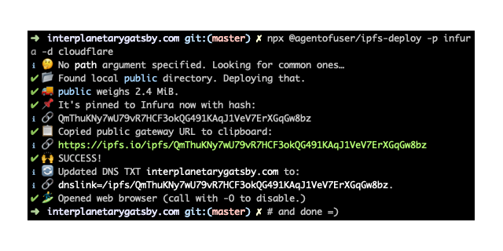

# @agentofuser/ipfs-deploy

[](#contributors)

[](https://github.com/RichardLitt/standard-readme)

> Upload static website to IPFS pinning services and optionally update DNS.

<p align="center">
  
</p>

The goal of `@agentofuser/ipfs-deploy` is to make it as easy as possible to
**deploy a static website to IPFS.**

## Table of Contents

- [Install](#install)
- [Usage](#usage)
- [API](#api)
- [Security](#security)
- [Background](#background)
- [Contributing](#contributing)
- [Who's Using](#users)
- [License](#license)

## Install

```bash
npm install -g @agentofuser/ipfs-deploy
```

Or

```bash
yarn global add @agentofuser/ipfs-deploy
```

You can call it either as `ipd` or as `ipfs-deploy`:

```bash
ipd public/
ipfs-deploy public/
```

### No install:

You can run it directly with [npx](https://www.npmjs.com/package/npx 'npx')
without needing to install anything:

```bash
npx @agentofuser/ipfs-deploy _site
```

It will deploy to a public pinning service and give you a link to
`ipfs.io/ipfs/your-hash` so you can check it out.

## Usage

You can get started just by typing out **ipd** and it will have smart defaults.

It deploys to a service that doesn't need signup and gives you a link like
`ipfs.io/ipfs/hash` that you can use to see if everything went ok.

When you don't specify a path argument to deploy, **ipfs-deploy** tries to
guess it for you based on the build directories used by the most popular static
site generators:

```javascript
const guesses = [
  '_site', // jekyll, hakyll
  'site',
  'public', // gatsby, hugo
  'dist', // nuxt
  'output', // pelican
  'out', // hexo
  'build', // metalsmith, middleman
  'website/build', // docusaurus
  'docs',
]
```

---

The `--help` option has some additional usage examples:

```
Examples:
  ipfs-deploy                               # Deploys relative path "public" to
                                            ipfs.infura.io/ipfs/hash; doesn't
                                            update DNS; copies and opens URL.
                                            These defaults are chosen so as not
                                            to require signing up for any
                                            service or setting up environment
                                            variables on default use.

  ipfs-deploy -p pinata _site               # Deploys path "_site" ONLY to
                                            pinata and doesn't update DNS

  ipfs-deploy -p infura -p pinata -d        # Deploys path "public" to pinata
  cloudflare                                and infura, and updates cloudflare
                                            DNS
```

To use Pinata and Cloudflare you need to sign up for those services. You can
read up on that over at:

https://www.cloudflare.com/distributed-web-gateway

and:

https://pinata.cloud/documentation#GettingStarted

(Infura doesn't require creating an account and is therefore the default
pinning service used.)

After setting up your Cloudflare and Pinata accounts, in your website's
repository root, create or edit the file `.env` with your domain and
credentials:

```
IPFS_DEPLOY_SITE_DOMAIN=
IPFS_DEPLOY_PINATA__API_KEY=
IPFS_DEPLOY_PINATA__SECRET_API_KEY=
IPFS_DEPLOY_CLOUDFLARE__API_EMAIL=
IPFS_DEPLOY_CLOUDFLARE__API_KEY=
```

(**Don't** commit it to source control unless you know what you're doing.)

```
$ echo '.env' >> .gitignore
```

Assuming your website's production build is at the `public` subdirectory
(that's what Gatsby and Hugo use; Jekyll and Hakyll use `_site`), run this at
the project's root:

```bash
ipd public
```

To see more details about command line usage, run:

```bash
ipd -h
```

You can optionally add a deploy command to your `package.json`:

```javascript
//  ⋮
  "scripts": {
//  ⋮
    "deploy": "npx @agentofuser/ipfs-daemon public",
//  ⋮
  }
//  ⋮
```

Then to run it, execute:

```bash
npm run deploy
```

## API

This is still pretty unstable and subject to change, so I will just show how
the executable currently uses the API.

```javascript
const deploy = require('@agentofuser/ipfs-deploy')

;(async () => {
  try {
    const deployOptions = {
      publicDirPath: argv.path,
      copyPublicGatewayUrlToClipboard: !argv.noClipboard,
      open: !argv.O,
      remotePinners: argv.p,
      dnsProviders: argv.d,
      siteDomain: argv.siteDomain,
      credentials: {
        cloudflare: {
          apiKey: argv.cloudflare && argv.cloudflare.apiKey,
          apiEmail: argv.cloudflare && argv.cloudflare.apiEmail,
        },
        pinata: {
          apiKey: argv.pinata && argv.pinata.apiKey,
          secretApiKey: argv.pinata && argv.pinata.secretApiKey,
        },
      },
    }

    deploy(deployOptions)
  } catch (e) {}
})()
```

## Security

We use `dotenv` to handle credentials. Don't commit your `.env` file to source
control.

## Background

So far, `ipfs-deploy` integrates with these services:

- [Infura.io](https://infura.io): freemium pinning service. Doesn't require
  signup. (Default.)
- [Pinata.cloud](https://pinata.cloud): freemium pinning service. Gives more
  control over what's uploaded. You can delete, label, and add metadata.
- [Cloudflare DNS](https://cloudflare.com): freemium DNS API. Supports CNAME
  for naked domains and integrates with their IPFS gateway at
  [cloudflare-ipfs.com](https://cloudflare-ipfs.com).

Feel free to request or add support to other services and send a PR.

You can start using `ipfs-deploy` without signing up for anything.

Default settings deploy to [infura.io](https://infura.io), which doesn't
request an account to pin stuff. They probably do some rate-limiting, but
either way, take it easy on them. Being able to try IPFS out without friction
and without giving out personal info is a very important smooth on-ramp.

Cloudflare IPFS doesn't host the content itself (it's a cached gateway), so a
stable pinning service is needed if you don't want to rely on your computer's
IPFS daemon's availability to serve your website.

These are free services subject to their terms. Not a decentralization nirvana
by any stretch of the imagination, but a nice way to get started quickly with a
blog, static website, or frontend web app.

If you use this package to deploy your website, please send a pull request so I
can add it to the [Users](#users) section in the README. (I reserve the right
to exercise discretion.)

## Contributing

PRs accepted. Please open an issue first so we can talk about it.

Small note: If editing the Readme, please conform to the
[standard-readme](https://github.com/RichardLitt/standard-readme)
specification.

## Users

- [agentofuser.com](https://agentofuser.com)
- [interplanetarygatsby.com](https://interplanetarygatsby.com)

## License

[BlueOak-1.0.0 OR BSD-2-Clause-Patent OR MIT © Agent of User](./LICENSE.md)

(The first two are the most permissive possible ever, more than MIT, which
doesn't have a patent waiver. Use whichever satisfies your lawyer better.)

## Contributors

Thanks goes to these wonderful people
([emoji key](https://allcontributors.org/docs/en/emoji-key)):

<!-- ALL-CONTRIBUTORS-LIST:START - Do not remove or modify this section -->
<!-- prettier-ignore -->
<table><tr><td align="center"><a href="https://tableflip.io"><br /><sub><b>Oli Evans</b></sub></a><br /><a href="https://github.com/agentofuser/ipfs-deploy/commits?author=olizilla" title="Code">💻</a> <a href="#ideas-olizilla" title="Ideas, Planning, & Feedback">🤔</a></td><td align="center"><a href="https://agentofuser.com"><br /><sub><b>Agent of User</b></sub></a><br /><a href="https://github.com/agentofuser/ipfs-deploy/commits?author=agentofuser" title="Code">💻</a></td></tr></table>

<!-- ALL-CONTRIBUTORS-LIST:END -->

This project follows the
[all-contributors](https://github.com/all-contributors/all-contributors)
specification. Contributions of any kind welcome!
